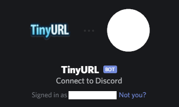
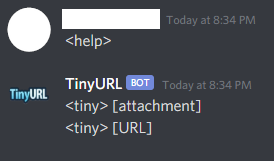

# discord-tinyurl

[](https://github.com/wlamason/discord-tinyurl/blob/master/LICENSE)

> 🤖 Discord bot to create tiny URLs for links, embeds, and attachments.


## Project Objective
Enable discord users to make tiny urls for links and discord cdn objects (files, attachments, images) directly in text channels.

## Invite to your Discord Server

Feel free to invite or self-host your own.

[](https://discord.com/api/oauth2/authorize?client_id=579534804471513100&permissions=130112&scope=bot)
[Invite link.](https://discord.com/api/oauth2/authorize?client_id=705569193734438924&permissions=93248&scope=bot)

## Commands



## Self-Hosting

[Documentation on how to create a discord bot account and receive a login token.](https://discordpy.readthedocs.io/en/latest/discord.html)


### Install

```sh
npm install
```

<<<<<<< Updated upstream
## Usage
=======
### Run Locally
>>>>>>> Stashed changes

Local usage:

```sh
TOKEN=xxxxx node bot.js
```

<<<<<<< HEAD
<<<<<<< Updated upstream
=======
### 🐳 Run with Docker
=======
🐳 Docker usage:
>>>>>>> a958609471e69f8523f3b58d59afd7ef22273f7b

```sh
docker run -d -e "TOKEN=<YOUR_TOKEN_HERE>" --name discord-tinyurl --restart=always wlamason/discord-tinyurl
```

<<<<<<< HEAD
>>>>>>> Stashed changes
=======
>>>>>>> a958609471e69f8523f3b58d59afd7ef22273f7b
## Author

👤 **Will Lamason**

* Website: https://wlamason.github.io/
* Github: [@wlamason](https://github.com/wlamason)

## Show your support

Give a ⭐️ if this project helped you!


## 📝 License

Copyright © 2020 [Will Lamason](https://github.com/wlamason).

This project is [Apache License 2.0](wlamason) licensed.

***
_This README was generated with ❤️ by [readme-md-generator](https://github.com/kefranabg/readme-md-generator)_